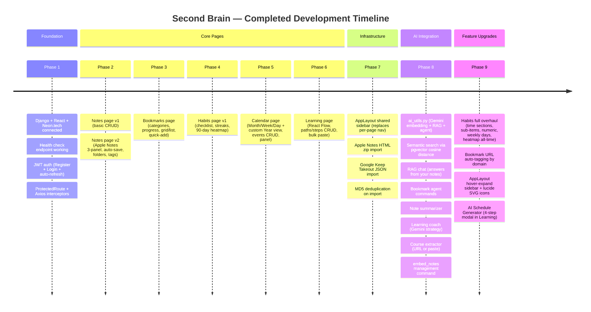
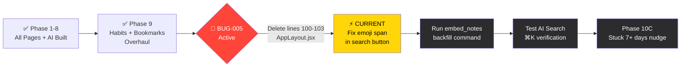
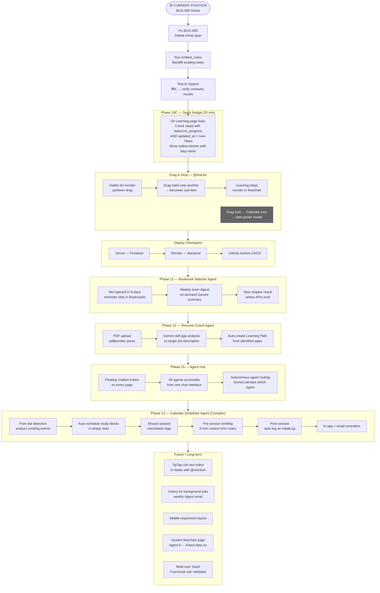
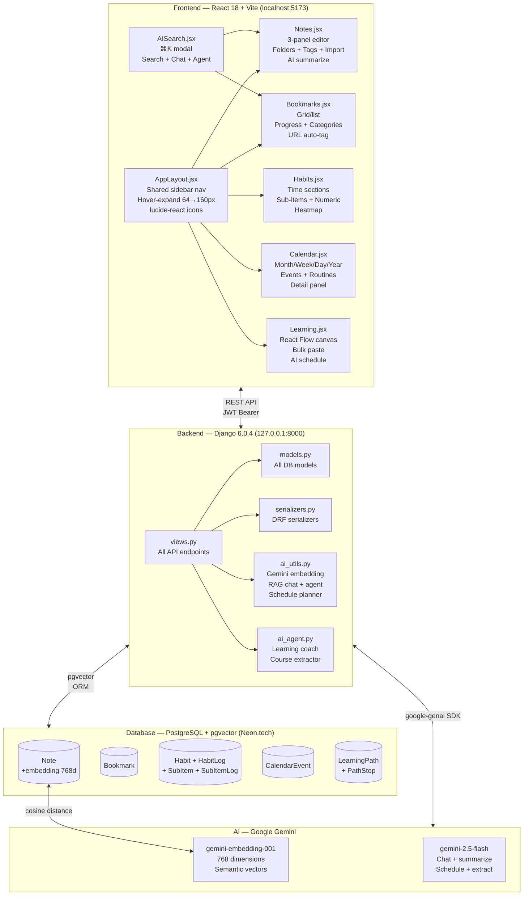
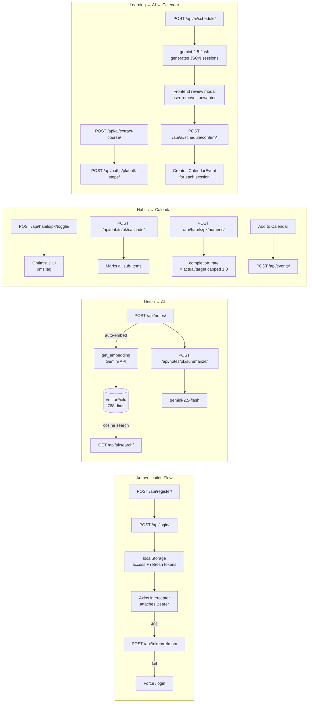
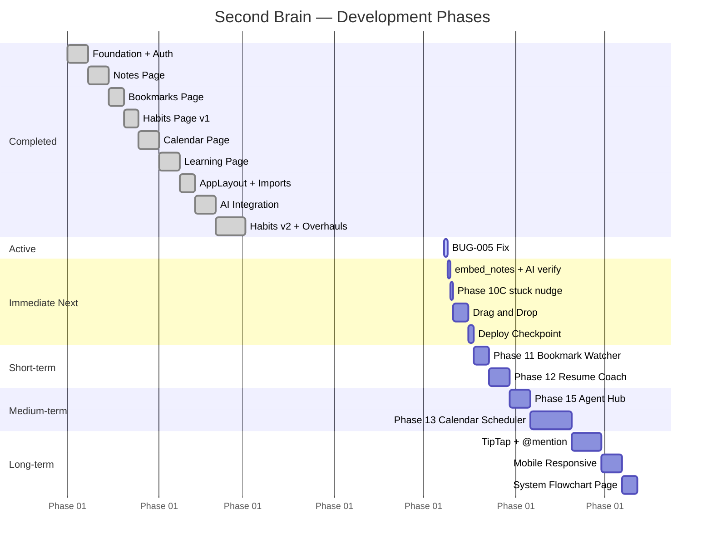
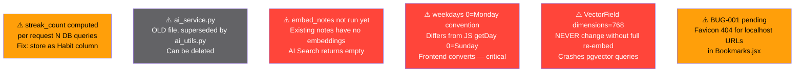

# 🧠 SECOND BRAIN — COMPLETE PROJECT FLOWCHART & ROADMAP

---

## 1. PROJECT OVERVIEW

**One-line summary:** A personal full-stack AI-powered knowledge management app (Notes + Bookmarks + Habits + Calendar + Learning Paths) with semantic search and autonomous agents.

**Main goal:** Never lose a resource, never miss a habit, never forget what you learned — all connected through AI.

---

## 2. CURRENT PROJECT STATUS

| Field | Value |
|---|---|
| **Current Phase** | Phase 8 complete, BUG-005 active, pre-deployment |
| **Current Active Task** | Fix BUG-005 — orphaned emoji span in AppLayout.jsx search button |
| **Immediate Next Task** | Run `embed_notes` → test AI Search → Phase 10C stuck nudge |
| **Active Bug** | BUG-005: Lines 100-103 in AppLayout.jsx have `🔎` emoji span alongside lucide `<Search>` SVG — delete lines 100-103 |
| **Current Working Files** | `frontend/src/components/AppLayout.jsx` |
| **Blocker** | BUG-005 must be fixed before clean deployment |

---

## 3. COMPLETED STEPS (CHRONOLOGICAL)



---

### Completed Features Checklist

```
INFRASTRUCTURE
✅ Django 6.0.4 + DRF backend
✅ React 18 + Vite frontend
✅ PostgreSQL + pgvector on Neon.tech
✅ JWT auth with auto-refresh (no silent logouts)
✅ CORS configured
✅ Axios interceptors (attach token + refresh on 401)
✅ ProtectedRoute auth guard
✅ AppLayout hover-expand sidebar (64px → 160px)
✅ lucide-react SVG icons in sidebar (replacing macOS-hijacked emoji)
✅ ⌘K global search shortcut

NOTES PAGE ✅
✅ Apple Notes 3-panel layout (folders | list | editor)
✅ Auto-save with 800ms debounce
✅ Folder organization
✅ #hashtag auto-detection
✅ Apple Notes HTML zip import
✅ Google Keep JSON zip import
✅ MD5 deduplication on re-import
✅ AI summarize button (Gemini)
✅ Skeleton loaders

BOOKMARKS PAGE ✅
✅ Grid + list view toggle
✅ Category system (auto-seeded: Article, Course, Manga, Research, Tool, Video)
✅ URL domain auto-tagging (youtube→Video, mangadex→Manga, etc.)
✅ Progress tracking ("Chapter 42", "45%", "Episode 5 of 12")
✅ Favorites system
✅ Folder organization
✅ Quick-add (paste URL → Enter)
✅ Last-opened tracking
✅ Optimistic updates on edit/create

HABITS PAGE ✅
✅ Daily + weekly habit types
✅ Weekly day picker (Mon/Tue/Wed/Thu/Fri/Sat/Sun)
✅ Weekly habits gray/locked on non-selected days
✅ Numeric habits (target + actual, partial circle fill)
✅ Sub-items (expand/collapse accordion, cascade toggle marks all children)
✅ Time-of-day sections (Anytime → Morning → Afternoon → Evening → Night)
✅ Each section collapsible with arrow
✅ Optimistic toggle (0ms perceived lag)
✅ pendingRef double-click guard
✅ Streak tracking with 🔥 counter
✅ Past Track heatmap (horizontal, all habits vertical, 1W/1M/3M/All)
✅ Inactivity collapsing in heatmap (>2 consecutive inactive days = collapsed)
✅ Start from first-ever log date (not arbitrary 90 days)
✅ Add-to-calendar per habit
✅ 3-dots menu per habit (Edit / Log Number / Add to Calendar / Delete)
✅ Global ⋮ options menu (view toggle + past track toggle)
✅ Table view (circles on RIGHT side)
✅ Card view (circles on LEFT side)
✅ Numeric modal via 3-dots (only shows when habit has target_value)
✅ Skeleton loaders

CALENDAR PAGE ✅
✅ Month / Week / Day views (react-big-calendar)
✅ Custom Year view (4×3 mini-month grid, own implementation)
✅ View-aware navigation (arrows respect current view)
✅ Event CRUD with modal (type, color, date, time, recurrence, notes)
✅ Recurring events (daily, weekly, monthly)
✅ Habits appear as all-day items on calendar
✅ Right detail panel (accumulates clicked events, doesn't replace)
✅ Mini-calendar in panel for quick navigation
✅ Event popup (when panel is off, click shows overlay)
✅ Apple dark mode CSS overrides for react-big-calendar

LEARNING PAGE ✅
✅ Learning paths CRUD
✅ Path steps CRUD
✅ React Flow canvas (draggable nodes, smoothstep edges, arrows)
✅ Status color coding (todo=grey, in_progress=orange, done=green)
✅ Step status update from detail panel
✅ Bulk paste steps (strips bullets/numbers automatically)
✅ Auto-arrange button (4-column grid reset)
✅ Node position persistence via useRef (no re-render lag during drag)
✅ Add step to Calendar (creates learning_session event)
✅ AI Course Extractor (URL or paste text → Gemini → chapters)
✅ AI Learning Coach (Gemini strategy advice)
✅ AI Schedule Generator (4-step modal: select → preferences → review → confirm)
✅ MiniMap + Controls

AI FEATURES ✅
✅ gemini-embedding-001 (768 dims, confirmed working on user's key)
✅ gemini-2.5-flash for generation
✅ pgvector cosine distance search
✅ Semantic search endpoint
✅ RAG chat (context from top-5 most similar notes)
✅ Bookmark agent command (natural language → update progress/favorite)
✅ Note summarizer (3-5 bullets)
✅ Learning coach (Gemini + path data)
✅ Schedule generator (Gemini → JSON sessions array)
✅ embed_notes management command (backfill existing notes)

BUGS FIXED
✅ BUG-002: text-embedding-004 not found → gemini-embedding-001
✅ BUG-003: gemini-2.0-flash quota=0 → gemini-2.5-flash
✅ BUG-004: Duplicate get_embedding import in views.py line 22
✅ Habit toggle 2-3s lag → optimistic update + pendingRef
✅ JWT silent logout → Axios response interceptor auto-refresh
✅ React Flow edge errors → explicit handle IDs on StepNode
✅ 🗺️ emoji rendering as macOS Maps icon → replaced with 📚 → replaced with lucide GraduationCap
✅ Pages clipped at half screen → root divs changed to height:100%, flex:1
✅ react-big-calendar dark mode → custom CSS injection
```

---

## 4. CURRENT FLOW POSITION



---

### BUG-005 Exact Fix

**File:** `frontend/src/components/AppLayout.jsx`

**Action:** Delete lines 100-103 (the orphaned `🔎` emoji span):

```jsx
// DELETE THESE 4 LINES (100-103):
<span style={{ fontSize: 18, flexShrink: 0, lineHeight: 1, 
    display: 'inline-block', fontVariantEmoji: 'emoji', userSelect: 'none' }}>
    🔎
</span>

// KEEP lines 104-109 (the lucide Search SVG — this is correct):
<Search
    size={18}
    strokeWidth={1.8}
    color="rgba(235,235,245,0.6)"
    style={{ flexShrink: 0 }}
/>
```

---

## 5. FUTURE ROADMAP



---

### Full Roadmap Table

| Phase | Feature | Priority | Complexity | Status |
|---|---|---|---|---|
| BUG-005 | Delete emoji span AppLayout.jsx | 🔴 Critical | Trivial | Active |
| Post-BUG | Run embed_notes command | 🔴 High | Trivial | Blocked by BUG-005 |
| 10C | Stuck 7+ days nudge on Learning | 🟡 High | Low (20 min) | Not started |
| DND-1 | Habit list reorder (@dnd-kit) | 🟡 High | Low | Not started |
| DND-2 | Drag habit → sub-task of another | 🟡 Medium | Medium | Not started |
| DND-3 | Learning steps reorder | 🟡 Medium | Low (React Flow built-in) | Not started |
| DND-4 | Drag task → Calendar icon | 🔵 Low | High | Later |
| Deploy | Vercel + Render + CI/CD | 🔴 High | Medium (2h) | Not started |
| 11A | Bookmark "not opened in N days" | 🟡 Medium | Low | Not started |
| 11B | Weekly brain digest | 🟡 Medium | Low | Not started |
| 12A | Resume PDF upload + parse | 🟡 High | Medium | Not started |
| 12B | Gemini skill gap analysis | 🟡 High | Low (prompt) | Not started |
| 12C | Auto-create Learning Path | 🟡 High | Low | Not started |
| 15 | Agent Hub floating chatbot | 🟡 High | Medium | Not started |
| 13A | Calendar free slot detection | 🔵 Medium | High | Not started |
| 13B | Auto-schedule study blocks | 🔵 Medium | High | Not started |
| 13C | Missed session reschedule | 🔵 Low | High | Not started |
| 13D | Pre-session briefing | 🔵 Low | Medium | Not started |
| 13E | Post-session habit log | 🔵 Low | Medium | Not started |
| 13F | In-app + email reminders | 🔵 Low | High (Celery) | Not started |
| Future | TipTap @mention in Notes | 🔵 Low | High | Not started |
| Future | Mobile responsive layout | 🔵 Low | High | Not started |
| Future | System flowchart page | 🔵 Low | Medium | Not started |
| Future | Multi-user SaaS | ⚪ Idea | Very High | Not started |

---

## 6. MODULE RELATIONSHIP FLOWCHART



---

## 7. API DEPENDENCY FLOW



---

## 8. DEVELOPMENT PHASES OVERVIEW



---

## 9. IMPORTANT DECISIONS QUICK REFERENCE

| Decision | Choice | Why |
|---|---|---|
| Backend framework | Django + DRF | ORM, admin, JWT mature ecosystem |
| Database | PostgreSQL + pgvector | Relational + vector search in one DB |
| DB host | Neon.tech | Free, serverless, pgvector supported |
| Frontend | React 18 + Vite | Already on resume, SPA sufficient |
| Styling | Inline styles per page | Precise control, no class conflicts |
| Embedding model | `gemini-embedding-001` | Only model that worked on user's API key |
| Chat model | `gemini-2.5-flash` | Free tier, sufficient quality |
| Gemini SDK | `google-genai` (new) | User already installed this |
| JWT storage | localStorage | Simple for single-user personal tool |
| Habit delete | Soft delete (is_active=False) | Preserves HabitLog history |
| Weekdays convention | 0=Monday (Python) | Matches datetime.weekday() |
| Inactivity collapse threshold | >2 days (3+) | 1-2 days = normal weekly habit gap |
| Drag library | @dnd-kit (planned) | Modern, Notion/Linear standard |
| Background jobs | No Celery yet | Not needed until Agent 3 |

---

## 10. TECH DEBT & WARNINGS



---

## 11. START FROM HERE — NEW CHAT CONTEXT HANDOFF

```
━━━━━━━━━━━━━━━━━━━━━━━━━━━━━━━━━━━━━━━━━━━━━━━━━━━━━━━━
🚀 START FROM HERE — PASTE THIS INTO NEW CHAT
━━━━━━━━━━━━━━━━━━━━━━━━━━━━━━━━━━━━━━━━━━━━━━━━━━━━━━━━

PROJECT: Second Brain — personal full-stack PKM app
DEVELOPER: Janesh (Secunderabad, India, macOS, Chrome)

STACK:
- Frontend: React 18 + Vite, inline styles (NOT Tailwind in pages), 
  React Router v6, Axios + JWT interceptors, React Flow, react-big-calendar, 
  lucide-react, @dnd-kit (planned)
- Backend: Django 6.0.4 + DRF, djangorestframework-simplejwt
- DB: PostgreSQL + pgvector on Neon.tech (VectorField dimensions=768)
- AI: google-genai SDK (new, NOT google-generativeai)
      gemini-embedding-001 (768 dims — CONFIRMED WORKING)
      gemini-2.5-flash (generation)
- Package manager: uv (backend), npm (frontend)

DESIGN SYSTEM (copy-pasted at top of every page file):
const C = {
  bg:'#1C1C1E', sidebar:'#2C2C2E', sep:'rgba(84,84,88,0.55)',
  accent:'#FFD60A', t1:'#FFFFFF', t2:'rgba(235,235,245,0.6)',
  t3:'rgba(235,235,245,0.28)', danger:'#FF453A', success:'#32D74B',
  font:"-apple-system,BlinkMacSystemFont,'Helvetica Neue',system-ui,sans-serif"
}

COMPLETED: Notes ✅ Bookmarks ✅ Habits ✅ Calendar ✅ Learning ✅ 
           AppLayout ✅ AI Search/Chat/Agent ✅ JWT auto-refresh ✅
           Optimistic habit toggle ✅ Past track heatmap ✅ 
           AI Schedule Generator ✅ Import Apple/Google Keep ✅

ACTIVE BUG — BUG-005:
File: frontend/src/components/AppLayout.jsx
Problem: Search button has orphaned emoji span (🔎) on lines 100-103 
         alongside correct lucide <Search> SVG on lines 104-109
Fix: DELETE lines 100-103 (the emoji span only)

IMMEDIATE NEXT STEPS (in order):
1. Fix BUG-005 (delete lines 100-103 in AppLayout.jsx)
2. Verify sidebar looks correct (hard refresh browser Cmd+Shift+R)
3. Run: uv run python manage.py embed_notes
4. Test AI Search from ⌘K bar
5. Phase 10C: "Stuck 7+ days" nudge on Learning page load
   - Check PathStep.status='in_progress' AND updated_at < now-7days
   - Show yellow banner: "{step.title} stuck for 7+ days. Resume?"
6. Add @dnd-kit drag-and-drop (habits list reorder, then sub-task drag)
7. Deploy: Vercel (frontend) + Render (backend)

CRITICAL WARNINGS:
⚠️ weekdays field: 0=Monday (Python) NOT 0=Sunday (JS). 
   Frontend converts: js_getDay()==0 ? 6 : js_getDay()-1
⚠️ VectorField(dimensions=768) — NEVER change without re-embedding all notes
⚠️ Soft delete habits (is_active=False) — never hard delete, preserves logs
⚠️ ai_service.py = old file, ignore. ai_utils.py = active AI module
⚠️ Each page has its OWN sidebar (folders/categories) separate from AppLayout

USER PREFERENCES:
- Explain WHY for each code change
- Knowledge Check question at end of each major step  
- Bug tracking: BUG-001, BUG-002 IDs. Resolved bugs → store in memory only
- Don't reprint full files unless necessary
- Confirm plan before generating code
- One page = one .jsx file with all sub-components inside

PLANNED ORDER:
1. BUG-005 fix         
2. embed_notes run
3. Phase 10C nudge (20 min)
4. Drag-and-drop @dnd-kit 
5. Deploy Vercel + Render  
6. Phase 11 Bookmark Watcher  ← YOU ARE HERE
7. Phase 12 Resume Coach
8. Phase 15 Agent Hub chatbot
9. Phase 13 Calendar Scheduler Agent (most complex)

━━━━━━━━━━━━━━━━━━━━━━━━━━━━━━━━━━━━━━━━━━━━━━━━━━━━━━━━
```
