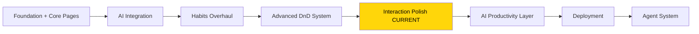
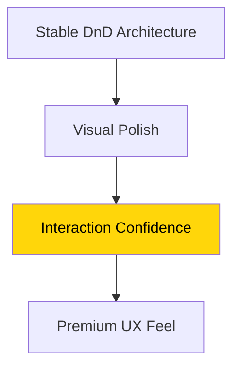
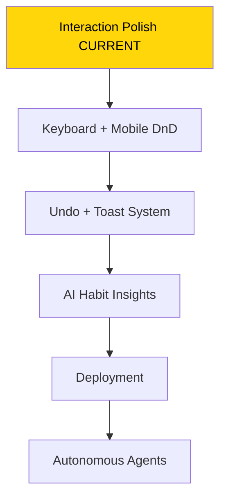
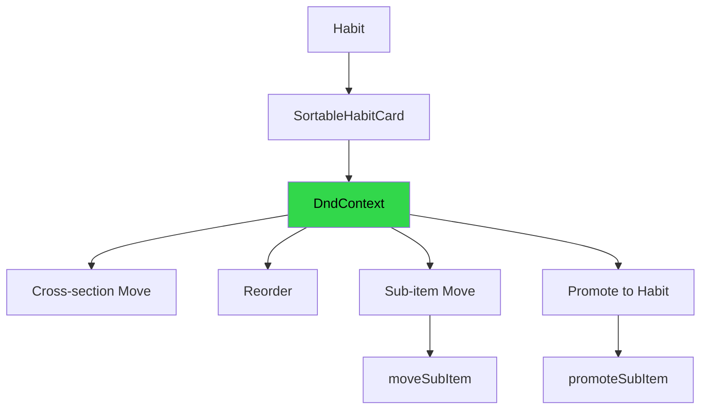
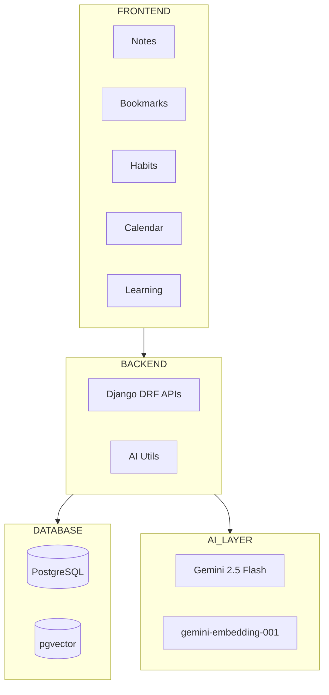
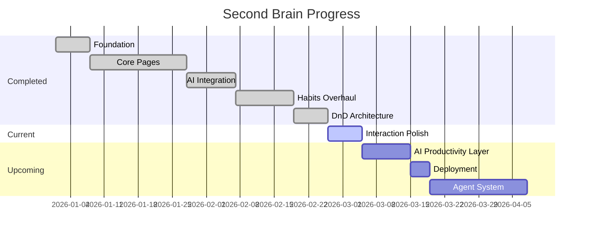

# 🧠 SECOND BRAIN — UPDATED PROJECT FLOW & ROADMAP

---

# 1. PROJECT OVERVIEW

## One-line Summary

AI-powered personal productivity and knowledge operating system with Notes, Habits, Calendar, Learning Paths, Bookmarks, and autonomous AI workflows.

## Main Goal

Build a unified “second brain” that:

* stores knowledge
* tracks habits
* organizes learning
* schedules work
* retrieves information semantically using AI
* eventually acts autonomously

---

# 2. CURRENT PROJECT STATUS

| Field                     | Status                        |
| ------------------------- | ----------------------------- |
| Current Main Phase        | Phase 9C — Interaction Polish |
| Current Focus             | Advanced Habits UX            |
| Current Active File       | `Habits.jsx`                  |
| Current System State      | Stable                        |
| Major Architecture Status | DnD architecture stabilized   |
| Current Priority          | UX confidence + polish        |
| Current Module            | Habits System                 |
| Backend Status            | Stable                        |
| Frontend Status           | Stable                        |
| AI Layer Status           | Working                       |
| Deployment Status         | Pending                       |

---

# 3. CURRENT DEVELOPMENT POSITION



---

# 4. COMPLETED DEVELOPMENT FLOW

```mermaid
timeline
    title Second Brain Development Timeline

    section Foundation
        Backend Setup : Django + DRF + JWT
        Frontend Setup : React + Vite
        Database : PostgreSQL + pgvector

    section Core Modules
        Notes : CRUD + folders + tags + import
        Bookmarks : categories + progress tracking
        Habits v1 : basic habits + streaks
        Calendar : Month/Week/Day/Year views
        Learning : React Flow roadmap system

    section AI Integration
        Semantic Search : pgvector + Gemini embeddings
        RAG Chat : note-aware AI responses
        AI Summaries : Gemini note summarizer
        Learning Coach : AI guidance
        Course Extractor : URL/text parsing

    section Habits Overhaul
        Time Sections
        Weekly Habit System
        Numeric Habits
        Sub-items
        Past Track Heatmap
        Table View
        Card View
        Optimistic Updates

    section Advanced Drag & Drop
        Habit Reordering
        Cross-section Move
        Sub-item Reordering
        Move Sub-items Between Habits
        Promote Sub-item to Habit
        Sticky Table Column
        Droppable Sections
        Drag Overlay
```



---

# 5. CURRENT HABITS SYSTEM STATUS

## COMPLETED

### Core Habit Features

* ✅ Daily habits
* ✅ Weekly habits
* ✅ Weekday picker
* ✅ Numeric habits
* ✅ Streak tracking
* ✅ Completion circles
* ✅ Time sections
* ✅ Table view
* ✅ Card view
* ✅ Past Track system

### Sub-item System

* ✅ Expand/collapse
* ✅ Toggle sub-items
* ✅ Cascade completion
* ✅ Add/delete sub-items
* ✅ Reorder sub-items
* ✅ Move sub-items between habits
* ✅ Promote sub-item to habit

### Drag & Drop System

* ✅ Reorder habits
* ✅ Cross-section dragging
* ✅ Sticky table task column
* ✅ Drag overlay
* ✅ Section droppable zones
* ✅ Optimistic reorder updates
* ✅ Backend reorder persistence

### UX Improvements

* ✅ Drag shadow overlay
* ✅ Better drop highlighting
* ✅ Improved drag handles
* ✅ Table scroll stability

---

# 6. CURRENT PHASE — INTERACTION POLISH



## Current Focus

Not adding major features.

Now focusing on:

* visual confidence
* interaction smoothness
* drag clarity
* usability
* polish

---

# 7. CURRENT UX ISSUES

## Active UX Friction

### Sub-item Promote UX

Problem:

* difficult to drag tiny sub-item outside accordion
* precision-heavy interaction
* nested drag boundaries

## Recommended Solution

Keep BOTH:

* drag-and-drop
* menu fallback action

---

# 8. NEXT UI POLISH TASKS

## HIGH PRIORITY

### 1. Promote to Habit Menu Item

Add:

```txt
⋮
Edit
Promote to Habit
Delete
```

Purpose:

* easier than drag
* mobile-friendly
* reliable UX

---

### 2. Better Drag Overlay

Current:

* functional

Next:

* shadow
* scale
* blur
* premium floating effect

---

### 3. Active Drop Indicators

Improve:

* dashed borders
* insertion line
* stronger hover highlight

---

### 4. Auto-expand on Hover

When dragging over collapsed habit:

* wait 700ms
* auto-open accordion

---

### 5. Drag Helper Text

Examples:

```txt
Drop outside to promote
```

or

```txt
Drop on section to convert
```

---

# 9. RECOMMENDED NEXT ROADMAP



---

# 10. IMMEDIATE NEXT TASKS

| Priority | Task                                | Status  |
| -------- | ----------------------------------- | ------- |
| HIGH     | Promote menu item                   | Pending |
| HIGH     | Better drag overlay animation       | Pending |
| HIGH     | Auto-expand accordion on drag hover | Pending |
| MEDIUM   | Keyboard drag support               | Pending |
| MEDIUM   | Mobile drag support                 | Pending |
| MEDIUM   | Undo reorder toast                  | Pending |
| LOW      | Multi-select habits                 | Future  |
| LOW      | Bulk actions                        | Future  |

---

# 11. HABITS DND ARCHITECTURE



---

# 12. CURRENT SYSTEM ARCHITECTURE



---

# 13. CURRENT MODULE MATURITY

| Module      | Status      |
| ----------- | ----------- |
| Notes       | Mature      |
| Bookmarks   | Mature      |
| Calendar    | Mature      |
| Learning    | Mature      |
| Habits      | Advanced    |
| DnD System  | Advanced    |
| AI Search   | Stable      |
| Agent Layer | Early       |
| Mobile UX   | Not Started |
| Deployment  | Pending     |

---

# 14. DEVELOPMENT PHASES



---

# 15. LONG-TERM ROADMAP

## AI Productivity Layer

* AI habit insights
* streak analysis
* missed habit nudges
* productivity summaries

## Deployment

* Vercel frontend
* Render backend
* production PostgreSQL
* CI/CD

## Agent Layer

* floating assistant
* autonomous planning
* smart scheduling
* reminder system

## Advanced Features

* mobile responsiveness
* TipTap editor
* background jobs
* multi-user SaaS

---

# 16. CURRENT POSITION SUMMARY

```txt
Foundation            ✅ Complete
Core Product          ✅ Complete
AI Layer              ✅ Working
Habits Overhaul       ✅ Complete
DnD Architecture      ✅ Stable
Interaction Polish    🔄 CURRENT
AI Productivity       ⏳ Next
Deployment            ⏳ Later
Agent System          ⏳ Future
```

---

# 17. MOST IMPORTANT CURRENT PRIORITY

## DO NOT ADD MASSIVE FEATURES NOW

You already crossed:

* CRUD phase
* architecture phase
* system-design phase

You are now in:

# PRODUCT FEEL PHASE

That means:

* animations
* interaction quality
* UX confidence
* responsiveness
* predictability
* polish

This phase is what makes apps feel:

* professional
* premium
* addictive to use

---
